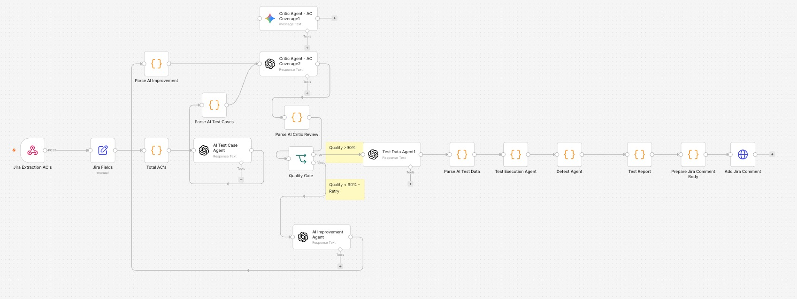
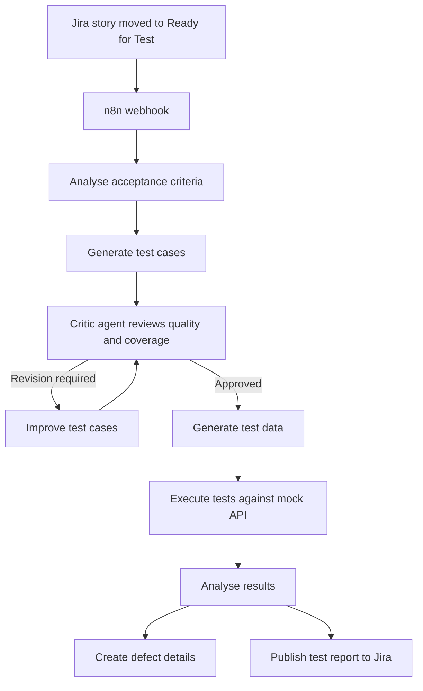

# Agentic AI QA Automation

An end-to-end quality-engineering workflow that uses Jira, n8n and AI agents to generate, review and execute tests from acceptance criteria.

> This is an independent portfolio/demo project. It uses sample Jira stories, test data and mock execution services—not production or employer data.

## Project Overview

Traditional test-design activities can require considerable manual effort:

* Reviewing acceptance criteria
* Creating test scenarios
* Checking test coverage
* Preparing test data
* Executing tests
* Recording results and defects

This project demonstrates how an agentic AI workflow can automate these activities while retaining critic-agent and human-review controls.

## Workflow Architecture



## End-to-End Workflow



The critic loop is limited to a maximum of three iterations to prevent uncontrolled execution.

## Workflow Components

### 1. Jira Trigger

The workflow starts when a Jira story transitions to **Ready for Test**.

The Jira automation sends:

* Issue key
* Summary
* Description
* Acceptance criteria

### 2. Acceptance-Criteria Analysis

The AI analyses the story to identify:

* Business rules
* Positive scenarios
* Negative scenarios
* Validation requirements
* Missing or ambiguous information
* Required test data

### 3. AI Test-Case Generation

The test-generation component creates structured test cases containing:

* Test-case ID
* Scenario
* Preconditions
* Test steps
* Test data
* Expected result
* Acceptance-criteria mapping
* Priority

### 4. Critic-Agent Review

A critic agent reviews the generated tests for:

* Acceptance-criteria coverage
* Positive and negative coverage
* Boundary conditions
* Clarity and completeness
* Duplicate scenarios
* Missing validations

If quality is below the required threshold, feedback is returned to the generator for revision.

### 5. Test-Data Generation

After critic approval, the workflow generates safe sample data for each test scenario.

### 6. Automated Test Execution

Tests are executed against a mock API selected according to the story and acceptance criteria.

The executor records:

* Request
* Response
* Status code
* Expected result
* Actual result
* Pass or fail status

### 7. Defect and Report Generation

Failed scenarios are analysed and converted into structured defect information.

The final report is posted back to Jira with:

* Execution summary
* Passed and failed tests
* Coverage information
* Defect details
* Critic-agent feedback

## Demonstrated Execution Result

| Measurement                   | Result |
| ----------------------------- | -----: |
| Acceptance-criteria coverage  |   100% |
| Initial critic quality score  |    90% |
| Quality after critic revision |   100% |
| Tests executed                |      5 |
| Passed                        |      4 |
| Failed                        |      1 |
| Defects identified            |      1 |

These figures represent one documented demonstration run using sample data and mock services.

## Testing Performed

The workflow was tested for:

* Valid Jira stories
* Missing acceptance criteria
* Invalid and incomplete payloads
* Positive and negative scenarios
* Critic approval and revision branches
* Maximum critic-loop enforcement
* Webhook failures
* Mock API failures
* Incorrect response status
* Failed test and defect-reporting paths
* Duplicate workflow executions
* Jira comment and report publication

## Human-in-the-Loop Controls

AI-generated outputs should not automatically be treated as approved production test assets.

The workflow supports human review before:

* Approving generated test cases
* Executing business-critical actions
* Creating or publishing defects
* Accepting final evaluation results

## Technology Stack

* n8n
* Jira and Jira Automation
* Python
* REST APIs and webhooks
* Docker
* Cloudflare Tunnel
* LLM APIs
* JSON
* Postman
* Mock API services

## Planned Repository Structure

```text
agentic-ai-qa-automation/
├── README.md
├── workflow/
│   └── agentic-ai-qa-workflow.json
├── mock-api/
│   └── app.py
├── sample-data/
│   ├── jira-story.json
│   └── test-execution-data.json
├── results/
│   └── sample-test-report.json
├── screenshots/
│   ├── workflow-overview.png
│   ├── critic-result.png
│   └── jira-report.png
├── .env.example
├── .gitignore
└── LICENSE
```

## Security

This repository must not contain:

* Jira passwords or API tokens
* LLM API keys
* Real customer or employer data
* Production URLs
* Confidential acceptance criteria
* Personal information

Credentials should be stored in environment variables or n8n credentials and represented only by placeholders in `.env.example`.

## Future Enhancements

* Automatically create Jira defect issues
* Add DeepEval-based agent evaluation
* Add prompt and model regression tests
* Add safety and prompt-injection scenarios
* Add CI/CD evaluation gates
* Track quality changes across workflow versions

## Author

**Prakash Ganji**
Senior QA / Test Lead | AI QA | Agentic AI and RAG Testing

* [GitHub Profile](https://github.com/prakash-aibuildtestlab)
* [YouTube — AI Build & Test Lab](https://www.youtube.com/@AIBuildTestLab)
* [LinkedIn](https://www.linkedin.com/in/prakash-ganji-437302b6)

---

**Build • Automate • Test**

