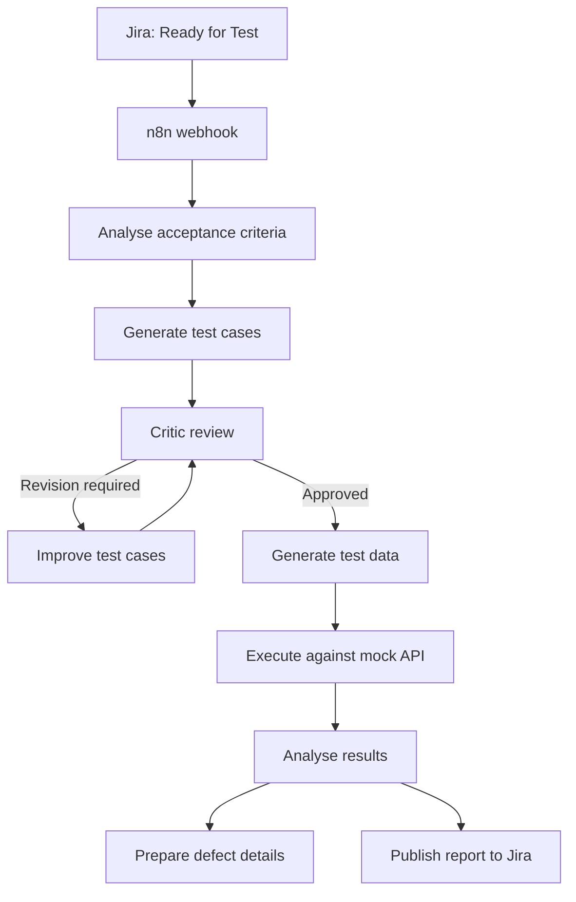

# Agentic AI QA Automation

An end-to-end quality-engineering workflow that uses Jira, n8n and AI agents to generate, review, improve and execute tests from acceptance criteria.

> **Portfolio disclaimer:** This is an independent demonstration project built with sample Jira stories, synthetic test data and mock execution services. It does not contain production, customer or employer data.

## Project Outcomes

This demonstration shows how an agentic workflow can:

- Extract acceptance criteria from a Jira story
- Generate structured positive, negative and boundary test scenarios
- Evaluate test quality and acceptance-criteria coverage using a critic agent
- Improve test cases when the quality threshold is not met
- Generate synthetic test data
- Execute tests against a mock API
- Analyse failures and prepare defect information
- Publish a consolidated execution report to Jira

## Workflow Architecture


## End-to-End Workflow



The critic loop is limited to a maximum of three iterations to prevent uncontrolled execution.

## Demonstrated Results

| Measurement | Result |
|---|---:|
| Acceptance-criteria coverage | 100% |
| Critic quality score | 95% |
| Final quality score at execution | 100% |
| Tests executed | 7 |
| Tests passed | 5 |
| Tests failed | 2 |
| Potential defects identified | 1 |
| Test pass rate | 71.4% |

These figures represent one documented demonstration run using sample data and mock services. Results can vary depending on the model, prompt, story and execution service.

## Full Evidence Report

📄 [View the complete Agentic AI QA demonstration evidence report](agentic-ai-qa-demonstration-evidence.pdf)

The report includes workflow architecture, critic-agent evaluation, test-execution evidence, potential-defect analysis and responsible-use controls.


## Workflow Components

### 1. Jira Trigger and Story Extraction

The workflow starts when a Jira story transitions to **Ready for Test**. Jira Automation sends the issue key, summary, description and acceptance criteria to an n8n webhook.

### 2. Acceptance-Criteria Analysis

The workflow analyses the story to identify:

- Business rules and validations
- Positive, negative and boundary scenarios
- Missing or ambiguous requirements
- Required test data
- Expected API behaviour

### 3. AI Test-Case Generation

The test-generation agent creates structured test cases containing:

- Test-case ID and scenario
- Preconditions and test steps
- Synthetic test data
- Expected result
- Acceptance-criteria mapping
- Priority

### 4. Critic-Agent Evaluation

The critic agent evaluates:

- Acceptance-criteria coverage
- Positive, negative and boundary coverage
- Clarity and completeness
- Duplicate or redundant scenarios
- Missing validations
- Overall quality score

When the score is below the configured threshold, the improvement agent revises the test cases and returns them for another critic review.

### 5. Test-Data Generation

After critic approval, the workflow generates synthetic test data aligned with each scenario. No real customer data is required.

### 6. Mock Test Execution

The execution component sends the generated requests to a configured mock API. The demonstration maps each story or operation to an appropriate mock endpoint through workflow configuration.

For every execution, it records:

- Request and response
- Status code
- Expected and actual result
- Pass or fail status

### 7. Defect Analysis and Jira Reporting

Failed scenarios are analysed and converted into structured potential-defect information. The final Jira comment contains:

- Execution summary
- Passed and failed tests
- Coverage and critic scores
- Failure evidence
- Potential-defect details
- Critic feedback

> A failed automated test is treated as a potential defect until it is reviewed and confirmed by a QA professional.

## Testing Performed

The workflow was exercised with:

- Valid Jira stories
- Missing or incomplete acceptance criteria
- Invalid and incomplete webhook payloads
- Positive, negative and boundary scenarios
- Critic approval and revision paths
- Maximum critic-loop enforcement
- Mock API and webhook failures
- Unexpected response status codes
- Failed-test and defect-reporting paths
- Duplicate workflow executions
- Jira comment publication

## Human-in-the-Loop Controls

AI-generated outputs should not automatically be treated as approved production test assets. Human review is recommended before:

- Approving generated test cases
- Executing business-critical actions
- Creating or publishing confirmed defects
- Accepting final evaluation results

## Technology Stack

- n8n
- Jira and Jira Automation
- LLM APIs
- REST APIs and webhooks
- JSON
- Docker
- Cloudflare Tunnel for local demonstration access
- Mock API services

## Repository Contents

```text
agentic-ai-qa-automation/
├── README.md
├── agentic-ai-qa-workflow.json
├── agentic-ai-qa-workflow.png.jpg
├── .gitignore
└── LICENSE
```

Planned evidence files include sample Jira payloads, synthetic execution reports and screenshots of critic and Jira results.

## Import and Configure

1. Download `agentic-ai-qa-workflow.json`.
2. In n8n, select **Import from File** and choose the downloaded workflow.
3. Configure your own Jira and LLM credentials in n8n.
4. Replace placeholder Jira and mock API URLs with your own safe test endpoints.
5. Review the prompts, model choices and quality threshold.
6. Keep the workflow inactive until all credentials and test endpoints are verified.
7. Test with sample Jira stories before connecting it to any real environment.

## Security and Responsible Use

Do not commit:

- Jira passwords, API tokens or credential IDs
- LLM API keys
- Real customer, employee or employer data
- Production URLs
- Confidential acceptance criteria
- Personal information

Store credentials in n8n Credentials or environment variables. Use placeholders in all public examples and manually review AI-generated test assets and defect information.

## Current Limitations

- Execution uses mock services rather than a production application.
- API routing is configured for the demonstrated sample stories.
- A failed test prepares potential-defect information but does not yet create a separate Jira defect automatically.
- LLM outputs can vary, so deterministic validation and human review remain necessary.
- This demonstration does not replace an organisation's test strategy, security controls or approval process.

## Future Enhancements

- Automatically create Jira defect issues after human approval
- Add DeepEval and RAGAS evaluation suites
- Add prompt and model regression tests
- Add safety and prompt-injection scenarios
- Add deterministic JSON-schema validation
- Add CI/CD quality gates
- Track evaluation results across workflow and model versions
- Add reusable configuration for story-to-endpoint routing

## Author

**Prakash Ganji**  
Senior QA / Test Lead | AI QA | LLM, RAG and Agentic AI Testing

- [GitHub Profile](https://github.com/prakash-aibuildtestlab)
- [YouTube — AI Build & Test Lab](https://www.youtube.com/@AIBuildTestLab)
- [LinkedIn](https://www.linkedin.com/in/prakash-ganji-437302b6)

---

**Build • Automate • Test**
